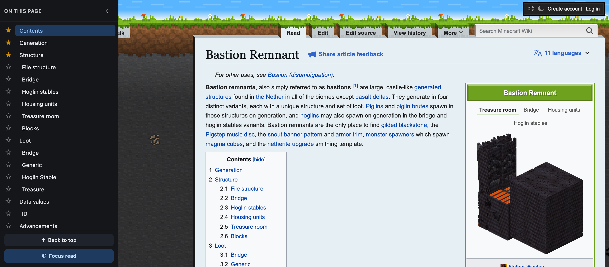
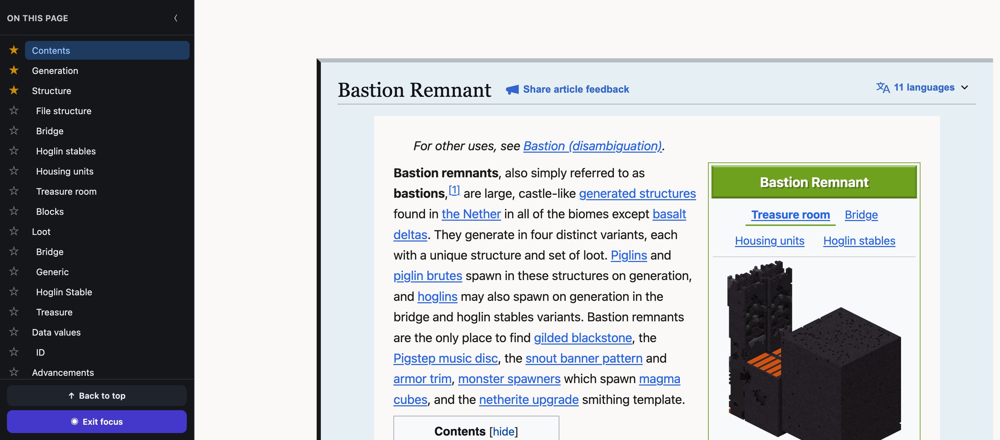
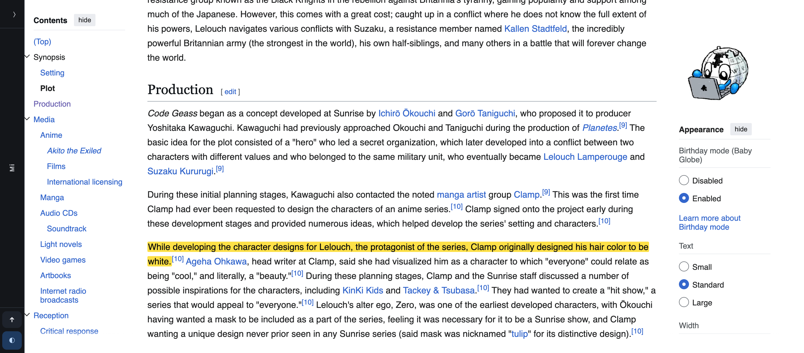
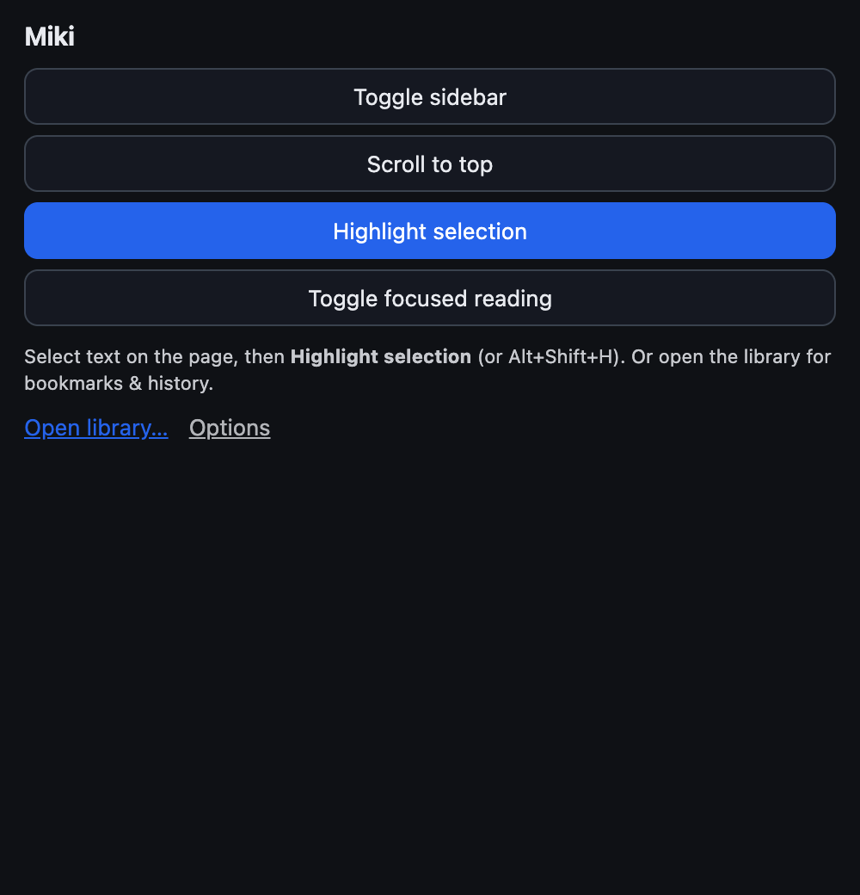
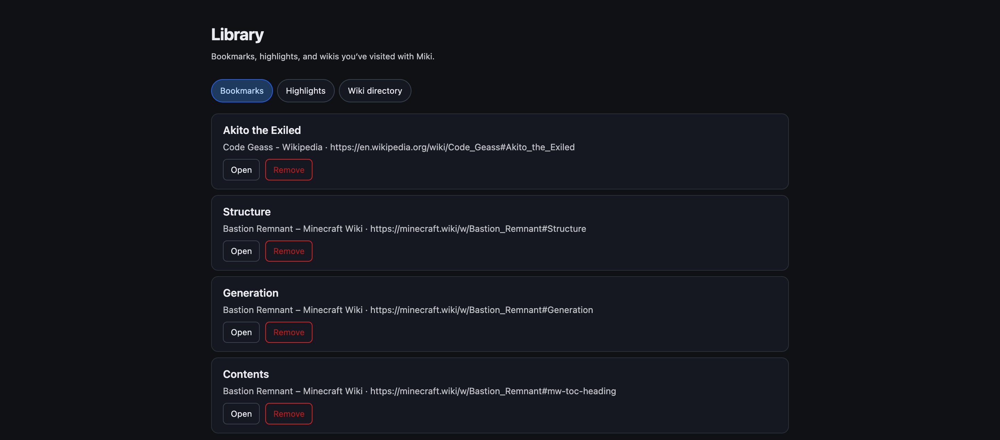
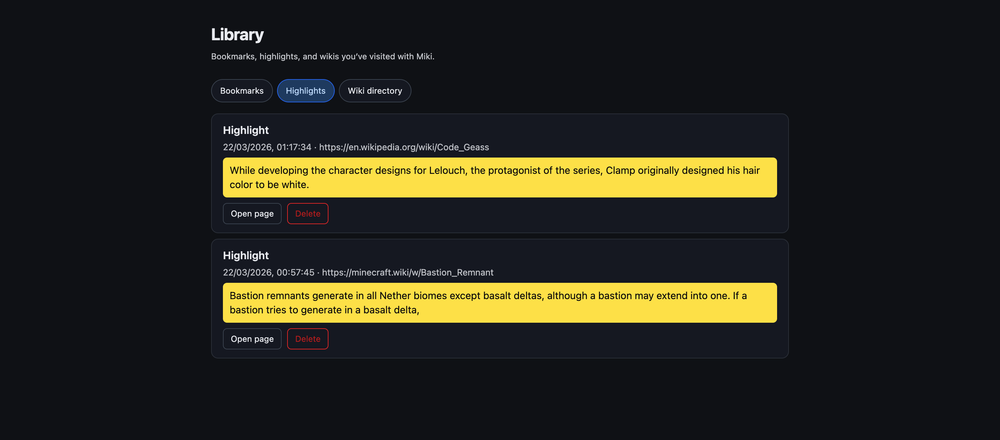
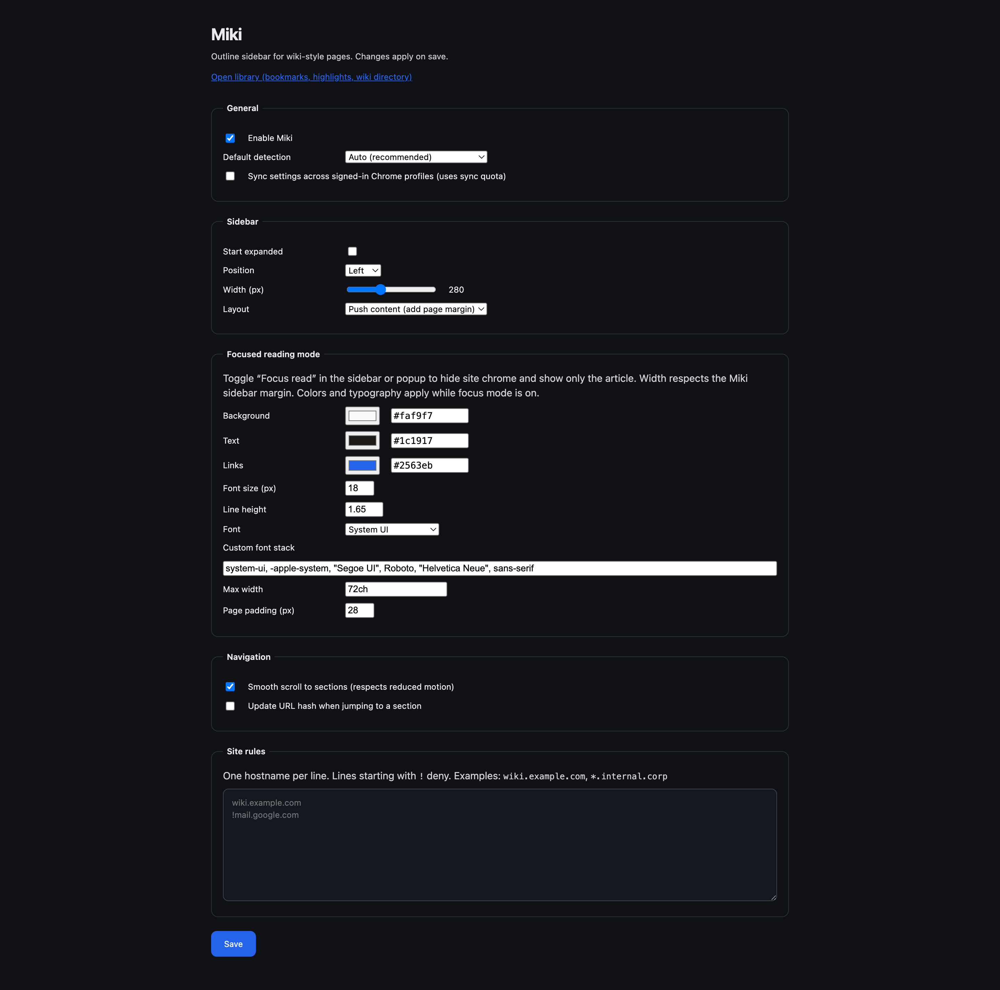

# Miki


<small>The toolbar icon is <b><i>absolutely</i></b> a cat: whiskers, a small Times-style "W" where the mouth goes, and the confidence of someone who spent five minutes in SVG and called it branding.</small>

<br clear="left"/>
<br clear="left"/>

Chrome extension (Manifest V3) that adds a **pinned, collapsible outline sidebar** to wiki-style pages: heading-based TOC, scrollspy, **section bookmarks** (☆ in the sidebar), **back to top**, **text highlights** (pen-style marks stored locally), a **wiki visit directory**, and a **Library** popup/dashboard for bookmarks, highlights, and history.

## Product spec

See [`specs/PRD.md`](specs/PRD.md).

## Development

Requirements: **Node 18+**, **npm**.

```bash
npm install
npm run build
```

Load the unpacked extension from the `dist/` directory:

1. Open `chrome://extensions`
2. Enable **Developer mode**
3. **Load unpacked** → select the `dist` folder

### Scripts

| Script | Description |
|--------|-------------|
| `npm run build` | Production build (`dist/`) |
| `npm run lint` | Typecheck (`tsc --noEmit`) |
| `npm test` | Unit tests (Vitest) |
| `npm run store-screenshots` | Chrome Web Store PNGs (**1280×800**, white pad; needs **ffmpeg**) → [`docs/store-screenshots/`](docs/store-screenshots/) |

The build runs two Vite passes: a **single IIFE** bundle for the content script (required for MV3 injection), then **background + options** as ES modules.

### Project layout

```
docs/
  PRIVACY.md          # Privacy policy (link from Chrome Web Store)
  screenshots/        # In-repo README captures
  store-screenshots/  # Chrome Web Store (1280×800 PNGs, see npm run store-screenshots)
icons/            # Toolbar icon (SVG + PNG sizes for manifest)
src/
  adapters/       # Wiki heuristics (MediaWiki, Git hosts, generic)
  background/     # Service worker, commands, storage broadcast
  content/        # Detection, outline, sidebar (Shadow DOM), layout, highlights
  dashboard/      # Library: bookmarks, highlights, wiki directory
  popup/          # Extension popup (quick actions + link to library)
  options/        # Options UI
  shared/         # Types, storage, domain rules, library (bookmarks/highlights/wikis)
tests/            # Vitest
specs/PRD.md
```

### Keyboard shortcuts

Configure under `chrome://extensions/shortcuts`:

| Default | Action |
|--------|--------|
| **Alt+Shift+W** | Toggle sidebar |
| **Alt+Shift+T** | Scroll to top |
| **Alt+Shift+H** | Highlight selected text |
| **Alt+Shift+R** | Toggle focused reading mode |

The **toolbar popup** opens a small menu: toggle sidebar, scroll to top, **highlight selection**, **focused reading mode**, and **Open library** (full tab with bookmarks, highlights, and wiki directory).

### Focused reading mode

Hides site chrome (nav, sidebars, footers outside the article) using a visibility chain so only the detected wiki **content root** stays visible—plus the Miki outline sidebar. Article width uses `min(your max width setting, available viewport width)` where **available width** subtracts the browser viewport edges **and** the space reserved by Miki’s push layout for the outline sidebar, so text lines up with the readable column.

Toggle from the outline footer (**Focus read** / **Exit focus**), the popup, or **Alt+Shift+R**. Appearance (background, text, link colors, font size, line height, font stack, max width, padding) is configured under **Options → Focused reading mode**. State is kept in `sessionStorage` per tab so a reload keeps focus mode until you exit.

### Text highlights

Highlights use a **yellow background with near-black text** (`#0a0a0a`) on the live wiki page and inside focused reading mode, so they stay readable even when the site forces light-colored article text. The Library dashboard uses the same contrast for saved highlight snippets.

### Screenshots

Captures live under [`docs/screenshots/`](docs/screenshots/) (**Minecraft Wiki** — [Bastion Remnant](https://minecraft.wiki/w/Bastion_Remnant); **Wikipedia** — [Code Geass § Production](https://en.wikipedia.org/wiki/Code_Geass#Production)), extension loaded via Chrome DevTools MCP.

**Article (1440×900 viewport)** — Bastion Remnant in normal mode shows **section bookmarks** (★) on a few outline rows; library/dashboard lists those bookmarks after capture.





**Wikipedia — [Production](https://en.wikipedia.org/wiki/Code_Geass#Production)** (same viewport; scrolled to the section).



**Extension UI**









Plain automation without `--load-extension` / your profile may still show the wiki **without** Miki; use **Load unpacked** on `dist/` or MCP flags that load the extension when reproducing these shots.

## Privacy

Settings stay in **chrome.storage** (local/sync per user choice). No remote analytics or third-party servers are used by this extension.

**Privacy policy (for Chrome Web Store / users):** [`docs/PRIVACY.md`](docs/PRIVACY.md) — host the file on GitHub and use the raw or `blob` URL in the store listing after replacing the bracketed contact/repo placeholders.

## License

[MIT](LICENSE)
